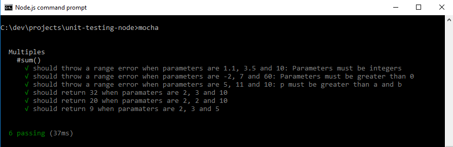

<!DOCTYPE html>
<html>
<head>
	<title>Unit Testing in NodeJS</title>
	<link rel="stylesheet" type="text/css" href="css/unit-testing-style.css">
</head>
<body>
	<h2>Unit Testing</h2>
	
Unit Testing is essential part of the Agile Methodologies. In these methodologies changes are welcome, so, refactoring code is a common task. Unit Tests are crucial to keep Working Software, as a rule Unit Tests are written before the code and updated them each time changes come up. Each method must have Unit Tests and pass all of them before the released, if a bug is found, a set of Unit Tests for it must be created.

	
Benefits of using Unit Tests

	<ul>
		<li>Finds problems early in the Software Development Life Cycle (SDLC)</li>
		<li>Preserve behavior when refactoring code</li>
		<li>Living Documentation</li>
		<li>Exceptions are documented</li>
		<li>Helps in the design process</li>
	</ul>
	
Unit Tests are written based on the criteria that becomes in the design contract for the method. This design contract can be updated during the Software Development Life Cycle (SDLC). The Unit Test should run either when the design contract is affected or the method is refactored in order to fix issues, improve performance or meet new requirements.

	
Unit Tests helps a lot to keep individuals modules working, to communicate changes in business rules, to avoid breaking the module, to avoid re-work, to save time in regression testing or integration testing. Helps other developer to communicate what the method does.

	
Good qualities of Unit Tests

	
Unit Tests should follow the acronym FIRST

	

		
F

ast

		
I

solated

		
R

epeatable

		
S

elf-validating

		
T

imely

	

	
FIRST was created by Tim Ottinger and Brett Schubert

	
<b>Fast:</b> many hundreds or thousands per second.

	
<b>Isolated:</b> failure reasons become obvious. The Unit Test should states the expecting assertion when certain conditions are met, so, the reason to fail is obvious. The Unit Test should do the 3 As (Arrange, Act, Assert)
		<ul>
			<li><b>Arrange:</b> The data needed for the test should be declared in the Unit Test.</li>
			<li><b>Act:</b> Invoke the actual method to be tested.</li>
			<li><b>Assert:</b> Compare the expecting result with the actual result from the method tested.</li>
		</ul>
	

	
<b>Repeatable:</b> Unit Tests should no depend on initial states, for example if the method depends on a database connection and if the database is not available by the time the Unit Test is run, that will cause the test to fail, in those conditions the Unit Test is not repeatable. In general, Unit Tests should no depends on external services, networks, connections or systems.

	
<b>Self-validating:</b> no manual evaluation or interpretation are required. An error should be thrown when the test has not passed, so, the test does not depend on manual inspection or data arrangement.

	
<b>Timely:</b> Wright the Unit Test to meet the requirements or criteria before to implement the method that will be evaluated, would be ideal in the SDLC, but most of the time this is not possible, since at the beginning of the process we do not have all the information needed, so we need to start with the information gathered so far and work iteratively. We can start by writing simple statements for our Unit Tests, wright the method to meet those statements, get more information (if needed), add the statements needed for the Unit Tests and update the method, repeat this process until business rules are met.

	
Example

	
Imagine in a hypothetic situation that you are given the following problem:

	
Find the sum of all different <b>multiples</b> for <b>a</b> and <b>b</b> that are below <b>p</b>, where:
		<ul class="list-lower-roman">
			<li>a, b and p are integers</li>
			<li>0 < a < p</li>
			<li>0 < b < p</li>
		</ul>
	

	
For example if the numbers are 2, 3 and 10, you have the following multiples: 2, 3, 4, 6, 8 and 9, the sum is 32.

	
For now we can write the following statements for our Unit Tests:

	

		<ul class="list-lower-roman">
			<li>should throw a range error when parameters are 1.1, 3.5 and 10: Parameters must be integers</li>
			<li>should throw a range error when parameters are -2, 7 and 60: Parameters must be greater than 0</li>
			<li>should throw a range error when parameters are 5, 11 and 10: p must be greater than a and b</li>
			<li>should return 32 when parameters are 2, 3 and 10</li>
			<li>should return 20 when parameters are 2, 2 and 10</li>
			<li>should return 9 when parameters are 2, 3 and 5</li>
		</ul>
	

	

		If we list the multiples of 2 and 3 that are below 10 we have		
		<ul class="list-none-style">
			<li><b>2 =></b> 2, 4, 6, 8</li>
			<li><b>3 =></b> 3, 6, 9</li>
		</ul>			
		We need to remove one of the 6s since they are repeated and get the sum.
	

	

		Since this is about Node.js, we are going to use JavaScript to write the method that will pass our Unit Tests, you can download the code for this example by clicking <a href="https://github.com/serodya/algorithms-csharp/archive/master.zip">here</a>. Below is the first version of the method sum():
	

	

	<pre>
	'use strict';

	function Multiples() {}

	var _prototype = Multiples.prototype;

	/**
	 * Finds the sum of all different multiples for a and b that are below p, where
	 * @param a an integer greater than 0
	 * @param b an integer greater than 0
	 * @param p an integer greater than a and b
	 */
	_prototype.sum = function(a, b, p) {
		var sum = 0;

		if (!Number.isInteger(a) || !Number.isInteger(b) || !Number.isInteger(p)) {
			throw new RangeError("Parameters must be integers");
		}

		if (a <= 0 || b <= 0 || p <= 0) {
			throw new RangeError("Parameters must be greater than 0");
		}

		if (p <= a || p <= b) {
			throw new Error("p must be greater than a and b");
		}

		for (var i = 1; a * i < p; i++) {
			sum += a * i;
		}

		if (a === b) {
			return sum;
		}

		for (var i = 1; b * i < p; i++) {
			if (i % a !== 0) {
				sum += b * i;
			}
		}

		return sum;
	};

	module.exports = Multiples;
	</pre>
	
	
	

		In order to run the Unit Tests we need to <a href="https://nodejs.org" target="_blank">install Node.js</a>, once you have it, you need to open the Node.js command prompt, go to the root folder for this example, then install <a href="http://mochajs.org/" target="_blank">Mocha</a> and <a href="http://chaijs.com/" target="_blank">Chai</a> using the below command in the console.
	
	
	
npm install mocha chai

	
<b>Mocha</b> needs a folder named <b>test</b> where you can add all your files that will do Unit Testing, if you already downloaded the code for this example, you can go to the root folder in the Node.js console and run the below command to execute the Unit Tests. For more info visit <a href="http://mochajs.org/#getting-started">Mocha getting started</a> and <a href="http://chaijs.com/api/bdd/" target="_blank">Chai Assertion Library</a>

	
mocha

	
<b>Mocha</b> will find the <b>test</b> folder and will run all the Unit Tests under the folder. The result will be displayed in the Node.js console as follow.

	

	
describe(), it(), beforeEach(), should(), expect...

	

		<ul>
			<li><b>describe():</b> To execute the test cases you will start with <b>describe()</b> method, that takes two parameters: name of your test and a callback function, describe() methods can be nested, so you can named the parent describe() as your class and the nested as the methods, in this example the class is <b>Multiples</b> and the method is <b>sum</b></li>
			<li><b>it():</b> function will execute the method to test, it() takes two parameters, the description of the test and a callback function. Chai will grab the method to test adding methods like <b>should</b>, so you can use assertions like sum.should.equal(20)</li>
			<li><b>beforeEach():</b> is useful when you have the same arrangement more than once for different tests. beforeEach() takes a function as a parameter, this function will be executed before each test</li>
			<li><b>expect():</b> you can use the expect() method to check for errors, expect() takes a function as a parameter</li>
		</ul>
	
	
	
Below is the code that yield the output displayed above. There is a default "BDD"-style interface that you can see <a href="http://mochajs.org/#hooks" target="_blank">here</a>

	

	<pre>
	'use strict';

	var Multiples = require('../multiples-of-numbers/Multiples'),
		chai = require('chai'),
		should = chai.should(),
		expect = chai.expect;

	describe('Multiples', function() {
		var multiples;

		beforeEach(function() {
			multiples = new Multiples();
		});

		describe('#sum()', function() {
			it('should throw a range error when parameters are 1.1, 3.5 and 10: Parameters must be integers', function() {
				expect(function() {
					var sum = multiples.sum(1.1, 3.5, 10);	
				}).to.throw(RangeError);
			});

			it('should throw a range error when parameters are -2, 7 and 60: Parameters must be greater than 0', function() {
				expect(function() {
					multiples.sum(-2, 7, 60);
				}).to.throw(RangeError);			
			});

			it('should throw a range error when parameters are 5, 11 and 10: p must be greater than a and b', function() {
				expect(function() {
					multiples.sum(5, 11, 10);
				}).to.throw(Error);
			});

			it('should return 32 when paramaters are 2, 3 and 10', function() {
				var sum = multiples.sum(2, 3, 10);

				sum.should.equal(32);
			});			

			it('should return 20 when paramaters are 2, 2 and 10', function() {
				var sum = multiples.sum(2, 2, 10);

				sum.should.equal(20);
			});

			it('should return 9 when paramaters are 2, 3 and 5', function() {
				var sum = multiples.sum(2, 3, 5);

				sum.should.equal(9);
			});
		});	
	});
	</pre>
	

	
Large numbers

	
So far we have simple test cases, what will happen if we use the parameters 2, 7 and 9007199254740991 (Number.MAX_SAFE_INTEGER). We do not know the result, but we can add the test case.

	

	<pre>
			it('should return ? when paramaters are 2, 7 and 9007199254740991', function() {
				var sum = multiples.sum(2, 7, 9007199254740991);

				//sum.should.equal(?);
			});	
	</pre>
	

	
If you run the "mocha" command, you will see the first 6 test cases passing, but the last one will never end. One of the problems here is when the calculations involve the Number.MAX_SAFE_INTEGER the result is uncertain, for example the results of the below statements are incorrect.

	

	<pre>
	Number.MAX_SAFE_INTEGER + 1 === Number.MAX_SAFE_INTEGER + 2; result = true
	(Number.MAX_SAFE_INTEGER + 1) % 2; result = 0
	(Number.MAX_SAFE_INTEGER + 2) % 2; result = 0
	</pre>		
	

	
So we are going to re-write the function, based on the following fact:
	
	

	
The conditions for the problem of Multiples ensure that exists n, m and k integers where they are the max factor for a, b and (a*b) that are below p, in other words

	

	<pre>
	0 < p - a*n < a
	0 < p - b*m < b
	0 < p - a*b*k < a*b
	</pre>		
	

	
The result that we are looking for is:

	

	
Since we cannot make operations over Number.MAX_SAFE_INTEGER, we need to find an upper bound condition for the parameters a, b and p. In the below equations maxSafeInteger = Number.MAX_SAFE_INTEGER

	

	
We do not need to check the value of abk(k + 1)/2 since sum is always greater than 0 and if ab > p, k will be 0. So, it is enough to meet the upper bound condition (2).

	

	Using the formula (1) and the upper bound condition (2), the method sum() will be as follow.
	

	

	<pre>
	'use strict';

	function MultiplesImproved() {}

	var _prototype = MultiplesImproved.prototype;

	/**
	 * Finds the sum of all different multiples for a and b that are below p, where
	 * @param a an integer greater than 0
	 * @param b an integer greater than 0
	 * @param p an integer greater than a and b
	 */
	_prototype.sum = function(a, b, p) {
		if (!Number.isInteger(a) || !Number.isInteger(b) || !Number.isInteger(p)) {
			throw new RangeError("Parameters must be integers");
		}

		if (a <= 0 || b <= 0 || p <= 0) {
			throw new RangeError("Parameters must be greater than 0");
		}

		if (p <= a || p <= b) {
			throw new Error("p must be greater than a and b");
		}
		
		var n = parseInt(p / a),
			m = parseInt(p / b),
			product = a * b,
			k = parseInt(p / product);

		if (p * (n + m + 2) > Number.MAX_SAFE_INTEGER) {
			throw new RangeError("Calculations over Number.MAX_SAFE_INTEGER");
		}

		n = p % a === 0 ? n - 1 : n;
		m = p % b === 0 ? m - 1 : m;
		k = p % product === 0 ? k - 1 : k;

		var sumAMultiples = a * this.triangularNumber(n);

		if (a === b) {
			return sumAMultiples;
		}

		var sumBMultiples = b * this.triangularNumber(m);
		var sumABMultiples = a * b * this.triangularNumber(k);

		return sumAMultiples + sumBMultiples - sumABMultiples;
	};

	_prototype.triangularNumber = function(n) {
		return n * (n + 1) / 2;
	};

	module.exports = MultiplesImproved;
	</pre>
	

	

	Now, we have better info than at the beginning, at this point we are able to predict the result for some test cases, even we can get an edge test case that yet meet the upper bound condition (2), for example 2, 7 and 137532243 will work, but 2, 7 and 137532244 will throw the expected range error. The result of these Unit Tests is displayed below.	
	

	

</body>
</html>